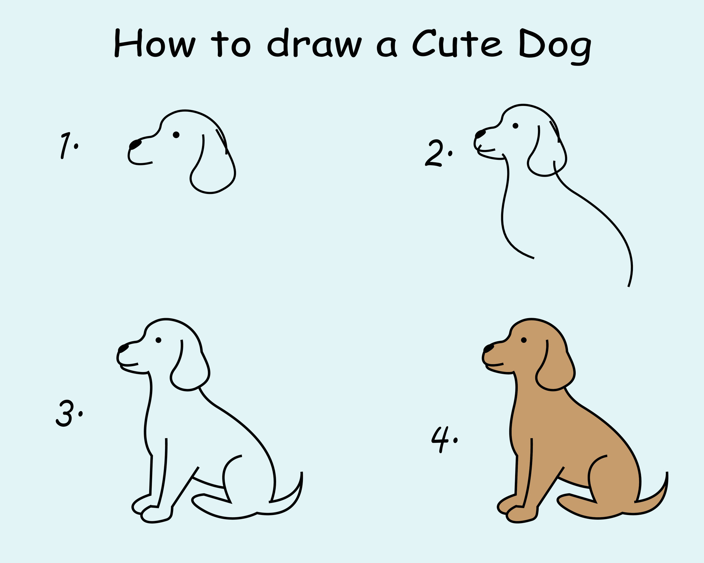

# Lecture: Intro to HTML

Front page of a website 
HyperText Markdown Language
Uses tags to display information on a site!
Think: The skeleton of a website!

## What is it?
It is a language used to build websites.

## Starting an HTML file: 
Create files needed: 
`touch index.html`

open files and write ! and then enter to get the abbreviation
Set up should look like this: 
```html 
<!DOCTYPE html>
<html lang="en">
<head>
  <meta charset="UTF-8">
  <meta name="viewport" content="width=device-width, initial-scale=1.0">
  <title>Document</title>
</head>
<body>
  
</body>
</html>
```

## Parent and child tags / Nesting

Examples of parent tags: 
- div
- ul
- ol

Child tags: 
- Any tag that is nested within another tag is considered a child tag. 
- Here is an example of what indentation could look like: 
```html
<figure>
  
  <figcaption>
    How to draw a <span> <b> dog</b> </span>
  </figcaption>
</figure>
```


## How to link multiple pages: 
Through the use of attributes!


## How to add an image

### External:  

### Internal:

### Why would we want to use one over the other? 

## Semantic Tags