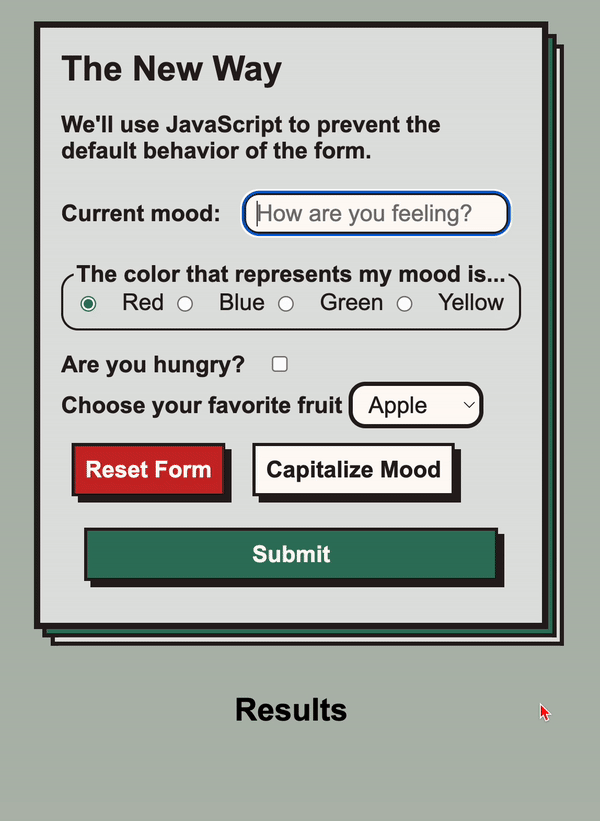

# 2.2.2 Lecture - Forms

**Table of Contents**

- [What is a form?](#what-is-a-form)
  - [Form Basic Structure](#form-basic-structure)
  - [Inputs](#inputs)
  - [Accesibility: Labels and aria-label](#accesibility-labels-and-aria-label)
  - [Submit button](#submit-button)
- [Handling Form Submissions](#handling-form-submissions)
  - [Original Form Submissions](#original-form-submissions)
  - [The Modern Way](#the-modern-way)
  - [FormData API](#formdata-api)
    - [One annoying gotcha: checkboxes](#one-annoying-gotcha-checkboxes)
  - [Resetting](#resetting)
- [Input types](#input-types)
- [Tracking Input and Non Submission Events](#tracking-input-and-non-submission-events)

**Q: What is a form and why is a form useful?**

## What is a form?
A form is a collection of inputs that can be filled out by a user to submit a collection of data. 



**Q: What kinds of data might we collect in a form?**

**Q:When should we use a form? For all user input?**

1. Click a button to pop open a tab with more data - use a `button`, not a `form`
2. A text input that filters the list of data shown - use an `input`, but not a full `form`
3. A link that takes the user to a new location - use an `anchor` or a `button`, not a `form`
4. Registering a new user with a name, password, and user details - use a `form`!

### Form Basic Structure

Forms are made up of a few parts:
- `<form>`: the container for the form
  - `h2 (or other header)`: A heading to describe your form
  - `<label>`: A label for each input
  - `<input>`: A place for the user to enter some data. There are many types (text, radio, checkbox, etc...)
  - `<button>`: A button to submit the form

Below is a full example! For now, just focus on the Elements that are in the example (`form`, `h2`, `label`, `input`, `button`)
```html
<form id="mood-form" aria-label="mood-form">
  <h2 id="mood-form-header">What is your mood?</h2>
  <p> Tell us how you are feeling </p>

  <!-- We often use divs to group together labels and inputs -->
  <div>
    <label for="current-mood">Current mood</label>
    <input type="text" id="current-mood" name="currentMood" placeholder="How are you feeling?">
  </div>

  <div>
    <label for="is-hungry">Are you hungry?</label>
    <input type="checkbox" id="is-hungry" name="isHungry">
  </div>

  <button class="submit">Submit</button>
</form>
```

There are a lot of attributes to learn, particularly for `label` and `input`. We'll go over them but here are the essential new ones that we'll cover:
* `form` Elements have an `aria-label` for accessibility
* `input` Elements have a `type` attribute to determine the kind of input (text, number, color, etc...)
* `input` Elements have a `name` attribute which will be used to extract data from the form
* `input` Elements MUST have an `id` attribute
* `label` Elements MUST have a `for` attribute equal to the `input` Element's `id`. This connects them.

### Inputs
Inputs are where users can input their data. Each `input` Element has a type — the basic inputs are `"text"` or `"number"` but there are many more cool ones.

Here is an example (note we're missing `label`s!)

```html
<form>
  <input type="text" id="username-input" name="username">
  <input type="number" id="age-input" name="age">
  <input type="checkbox" id="is-hungry-input" name="isHungry">
  <input type="color" id="favorite-color-input" name="favoriteColor">
</form>
```

> 💡 **Best Practice:** Use `kabob-case` for `id` and `camelCase` for `name` (we'll learn why in a moment)

Some other types of inputs Elements (other than the literal `input` tag) are the `select` and `textarea` (and technically `buttons`). 

**Inputs must have a `name` attribute.** We'll use those later when we are getting data from the form when it is submitted.

### Accesibility: Labels and aria-label

Right now, our form is just a bunch of inputs. But how does the user know which input is for which value? Well, for one, we could add a header:

```html
<form>
  <h2>Sign Up Form </h2>
  <input type="text" id="username-input" name="username">
  <input type="number" id="age-input" name="age">
  <input type="checkbox" id="is-hungry-input" name="isHungry">
  <input type="color" id="favorite-color-input" name="favoriteColor">
</form>
```

But that only helps our seeing users! When designing websites, we must design for ALL of our users. 

Labels are *crucial* for our non-seeing users and accessibility. They tell screen readers what the purpose of an element is. There are two kinds of labels that we'll use:
1. The `aria-label`/`aria-labelledby` attribute — describes the purpose of a `form` (or really of any element).
2. The `<label>` element — describes the purpose of an `<input>` element. 

```html
<form aria-labelled="sign-up-header">
  <h2 id="sign-up-header">Sign Up Form </h2>
  <div>
    <label for="username-input">Username:</label>
    <input type="text" id="username-input" name="username">
  </div>
  <div>
    <label for="age-input">Age:</label>
    <input type="number" id="age-input" name="age">
  </div>
  <div>
    <label for="is-hungry-input">Are you Hungry?</label>
    <input type="checkbox" id="is-hungry-input" name="isHungry">
  </div>
  <div>
    <label for="favorite-color-input">Favorite Color:</label>
    <input type="color" id="favorite-color-input" name="favoriteColor">
  </div>
</form>
```

A few notes about `aria-lablledby`
* **A**ccessible **R**ich **I**nternet **A**pplications (ARIA) is a set of roles and attributes that define ways to make web content and web applications more accessible to people with disabilities.
* We added an `id` to the `h2` element
* We added the `aria-lablledby` attribute to the `form` element so that screen readers know to use the `h2` element text as the aria label.

Here are a few notes about the `<label>` element:
* Connect the `<label>` to the `<input>` with the `for` attribute. It should be the same as the input's `id`: 
* Labels make it so that clicking a label will focus the input or check the checkbox.
* Labels help our seeing users too by describing the input!

Notice that we also wrap each `label` + `input` pair inside of a `div`. This isn't necessary but it makes styling each pair of elements a lot easier.

### Submit button

All forms should end with a submit button.

```html
<form aria-label="sign-up">

  <!-- labels + inputs -->

  <button type="submit">Submit</button>
  <!-- type="submit" is optional here -->
</form>
```

By default `button` elements have a `type="submit"` so you don't *need* to put it. But you can if you want! There are other types of buttons we'll discuss later.

Clicking the submit button (or pressing enter while focused inside a form) will fire the `'submit'` event on the form. 

Our objective is to...
1. listen for this `'submit'` event
2. create an event handler that extracts the user input data
3. do something with that data! (save it in a database, show it in the UI, etc...)

## Handling Form Submissions

### Original Form Submissions

But first...

Originally (and still with some frameworks) form submissions actually _change the page_.

See this difference by filling out the form in `1/old-form/original-way.html` which redirects the user to the new page after submitting. 

**Q: See how the URL changes to `results-page.html`? Notice the stuff appended to the end?**

```
results-page.html?username=ben&password=123
```

Old forms used a few attributes to achieve this behavior:
- `action` = the new page to go to
- `method` = `"get"` or `"post"` (`"get"` is default). `"get"` means we are requesting data using the form, `"post"` means we are sending data to be stored by the application
- The form data becomes “query params” in the URL of the new page if you use `"get"`

```html
<form action="./results-page.html" method="get">
  <!-- labels + inputs + submit button -->
</form>
```

This is the “default” behavior of the forms, which is NOT what we want. 


### The Modern Way

Instead of having the browser take us away from the page, most modern web applications are "single-page-applications" meaning they operate on a single HTML page that dynamically handles all DOM interactions through JavaScript. 

To handle a form submission while staying on the same page, we will need to:
1. prevent the default behavior
2. collect the form data
3. utilize the form data in some way (maybe render it to the screen, or send it to an API)
4. reset the form

If these are our inputs:

```html
<input type="text" name="username">
<input type="number" name="age">
<input type="checkbox" name="isHungry">
<input type="color" name="favoriteColor">
```

Then, we can handle this form on the same page like so:

```js
const handleSubmit = (event) => {
  // stop the reload/redirect
  event.preventDefault(); 

  // the form will be the target of the "submit" event
  const form = event.target;

  // We can access them one at a time like this:
  const username = form.username.value;
  const age = form.age.value;
  const checkbox = form.isHungry.isChecked // <-- checkboxes are different!
  const color = form.favoriteColor.value;

  // what should we do with those values?? here we are printing a sentence to the console
  // where only developers will see it. Can we put it on the screen somehow?
  console.log(`hello, I am user ${username}, I am ${age} years old and my favorite color is ${color}. ${isHungry ? "I am hungry" : "I am full"}.`);

  form.reset();
}

document.querySelector('form').addEventListener('submit', handleSubmit);
```

- `event.preventDefault()` stops the form submission from redirecting/reloading the page
- The `event.target` value will point to the `form` element
- Using the `form` element, we can access each `input` using the `name` attribute
- We can access the value of most `input` elements using the `.value` property but checkboxes use the `.checked` property.
- `form.reset()` empties out the form!

### FormData API

Another, potentially faster, way to get the values of a form is to use the `FormData` API. It starts off the same, we have to grab the `form` using `event.target`:

```js
const form = event.target;
const formValues = Object.fromEntries(new FormData(form));
console.log(formValues);
/* 
{
  currentMood: 'happy', 
  color: 'blue', 
  isHungry: 'on', 
  favoriteFruit: 'apple'
}
^ Notice something weird about isHungry?
*/
```

Let's break this down:
* We again store the `form` using `event.target`
* We invoke the function `new FormData()` with that `form` as an argument
* We immediately take the returned value and pass it to `Object.fromEntries()` which generates an Object with our form values!

#### One annoying gotcha: checkboxes
When using checkboxes, you would think they'd use a `true`/`false` setup, but nope! They use `"on"` and `undefined`.

So you'll need to do a little extra work to get them to be `true`/`false`:

```js
const form = e.target;
const formValues = Object.fromEntries(new FormData(form));
formValues.isHungry = Boolean(formValues.isHungry)
```

By converting the `formValues.isHungry` property into a Boolean, it will be `true` if the value is `"on"` or `false` if the value is `undefined`.

### Resetting
After you submit, sometimes you want to clear the form, so you can do that with `form.reset()` in the js, *or* on the form html itself, add a button with a type of reset

```html
<button type="reset">Reset</button>
```


## Input types
<!-- On the `index.html` go over the basic text inputs, but then also radio groups (with fieldsets and legends), and the select. Point out when to use them: -->
- `<input type="text">`: any open ended but short data
- `<input type="number">`: any number, min and max can lock you in (not featured on form, just mention)
- `<input type="radio">`: when you want to pick one of a few options
- `<textarea>`: any open ended but long data
- `<select>` and `<option>`: when you want to pick one of a *lot* of options

```html
<label for="favorite-fruit"> Choose your favorite fruit </label>
<select id="favorite-fruit" name="favoriteFruit">
  <option value="apple">Apple</option>
  <option value="banana">Banana</option>
  <option value="orange">Orange</option>
</select>
```


## Tracking Input and Non Submission Events
You can use an `input` event on an input (or fieldset) to track the changes at a more granular level:

```js
// Input elements have a `.value` property holding the current value
const handleInput = (e) => {
  console.log('new value:', e.target.value);
};

// We can grab inputs whenever they change, not just submissions
const moodTextInput = document.querySelector('#current-mood');
moodTextInput.addEventListener('input', handleInput);
```

If you specify a type of `button` on a button, it will not trigger a submit automatically. This is a pretty rare occurrence, but it's good to know! 

HTML:

```html
<button type="button" id="normal-button">Capitalize Mood</button>
```

JS:

```js
// here's an example of an event fired by a button that does not trigger a submission
const capitalizeMood = (e) => {
  console.log('e.target:', e.target);
  const form = document.querySelector('form');
  
  // we can also use query selector to get this input, but if we used checkboxes or radio elements, using the form is easier
  form.currentMood.value = form.currentMood.value.toUpperCase();
};

const normalButton = document.querySelector('#normal-button');
normalButton.addEventListener('click', capitalizeMood);
```