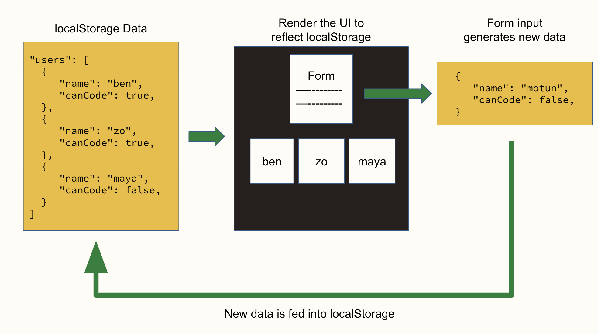

# 2-3-1-localStorage-f23

**Table of Contents**
- [What is localStorage?](#what-is-localstorage)
- [Setting and Getting Values](#setting-and-getting-values)
- [toString() vs. JSON.stringify()](#tostring-vs-jsonstringify)
- [Stringify and Parse](#stringify-and-parse)
- [`localStorage` Helpers](#localstorage-helpers)
- [Data Layer](#data-layer)

## What is localStorage?

The `localStorage` interface allows you to **store data across browser sessions**. 

It is an Object that is available on the `window` (it is globally available) and it has 4 methods:

- `localStorage.setItem(key, valueString)`
- `localStorage.getItem(key)`
- `localStorage.removeItem(key)`
- `localStorage.clear()`

## Setting and Getting Values

Storing data in a user's `localStorage` is like storing data in an Object. Every **value** we store is associated with a **key**.

* We store (set) values using `localStorage.setItem(key, valueString)`
* We retrieve (get) values using `localStorage.getItem(key)`

Note: `localStorage` **can only store strings** which we have to watch out for.

```js
localStorage.setItem('luckyNumber', 13);
localStorage.setItem('favoriteColor', 'purple');

const storedNumber = localStorage.getItem('luckyNumber');
const storedColor = localStorage.getItem('favoriteColor');

console.log(storedNumber);          // 13
console.log(storedColor);           // purple
console.log(typeof storedNumber);   // string
console.log(typeof storedColor);    // string
```


## toString() vs. JSON.stringify()

When using `setItem`, the value is turned into a string before being stored. It does this using the given value's `.toString()` method (every data type has this method).

As you can see, this is particularly annoying when dealing with Arrays and Objects because of the way that they get turned into strings.

```js
const num = 13;
const bool = true;
const str = 'purple';
const arr = [1, 2, 3];
const obj = { name: 'ben' };

console.log(num.toString());  // '13'
console.log(bool.toString()); // 'true'
console.log(str.toString());  // 'purple'
console.log(arr.toString());  // '1,2,3'  <-- mildly annoying that the [] are gone
console.log(obj.toString());  // '[object Object]'  <-- what is this garbage??

// JSON.stringify() is much better
console.log(JSON.stringify(arr)); // [1, 2, 3]
console.log(JSON.stringify(obj)); // { name: 'ben' }
```

However, the `JSON.stringify()` method preserves the structure of Arrays and Objects.

## Stringify and Parse

Before storing values in `localStorage`, we should `JSON.stringify()` them.

```js
const instructors = ['ben', 'gonzalo', 'motun', 'zo', 'carmen'];
const user = { name: 'ben', canCode: true };

// We typically will JSON.stringify() the value before we set it... 
localStorage.setItem('instructors', JSON.stringify(instructors));
localStorage.setItem('user', JSON.stringify(user));

// ...and JSON.parse() the value when we get it:
const storedInstructors = JSON.parse(localStorage.getItem('instructors'));
const storedUser = JSON.parse(localStorage.getItem('user'));

console.log('storedInstructors:', storedInstructors);
console.log('storedUser:', storedUser);
```

When retrieving a value from `localStorage`, we use the `JSON.parse()` method which takes a string and tries to turn it into a value

## `localStorage` Helpers

That's quite a bit of code to write and re-write every time we can to set or get values to/from `localStorage`. 

To reduce repetition, we often write these two helper functions:

```js
const setLocalStorageKey = (key, value) => {
  localStorage.setItem(key, JSON.stringify(value))
}

const getLocalStorageKey = (key) => {
  try {
    return JSON.parse(localStorage.getItem(key))
  } catch (err) {
    console.error(err);
    return null;
  }
}
```

We wrap the `JSON.parse()` function invocation in a `try/catch` block in the event that `JSON.parse()` can't determine the value type of the given string.
* If it can, it will return the value.
* If it can't, the error will be printed (and not break everything) and `null` will be returned.

Now, we can safely use these functions instead of the `localStorage` ones and know that all values will be properly stored and retrieved.

```js
setLocalStorageKey('nums', [1, 2, 3])
const storedArr = getLocalStorageKey('nums');

setLocalStorageKey('user', { name: 'ben' });
const storedUser = getLocalStorageKey('user');

console.log(storedArr);  // [1, 2, 3]
console.log(storedUser); // { name: 'ben' }
```

## Data Layer

As you can see, working with `localStorage` can be quite tricky. We want to ensure that our application works in a **consistent and predictable** manner.

To achieve this, we will typically:
* **isolate the logic** for dealing with `localStorage` in its own file. 
* create functions for interacting with `localStorage`. 
* **only export the functions that indirectly interact with `localStorage`**. 

This way, we create a **consistent** and **predictable** interface.

```js
// local-storage.js

// Generic localStorage helpers
const setLocalStorageKey = (key, value) => {
  localStorage.setItem(key, JSON.stringify(value))
}

const getLocalStorageKey = (key) => {
  try {
    return JSON.parse(localStorage.getItem(key))
  } catch (err) {
    console.error(err);
    return null;
  }
}

// These two will be used by the rest of the functions a lot
export const getNames = () => getLocalStorageKey('names');
export const setNames = (names) => setLocalStorageKey('names', names);

// More helper functions
export const initializeNames = () => setNames(['ben', 'gonzalo', 'motun']);

export const addName = (name) => {
  const names = getNames();
  setNames([...names, name]);
}

export const removeName = (nameToRemove) => {
  const names = getNames().filter((name) => name !== nameToRemove);
  setNames([...names]);
}
```

And always remember to test your code!

```js
// mains.js
import { initializeNames, addName, getNames } from './local-storage.js';

initializeNames();
console.log(getNames());  // ['ben', 'gonzalo', 'motun']

addName('carmen');
addName('zo');
console.log(getNames());  // ['ben', 'gonzalo', 'motun', 'carmen', 'zo]

removeName('ben');
console.log(getNames());  // ['gonzalo', 'motun', 'carmen', 'zo]
```

**Q: What makes this predictable and consistent?**

<details><summary>Answer</summary>

This is predictable and consistent because
* we control what the user of these functions can do (set, get, initialize, add, remove)
* the caller of those exported functions doesn't directly interact with `localStorage`
* the exported functions handle the interaction with `localStorage`

Sure, we can interact with `localStorage` outside of this file too but we should avoid that if we want to maintain the predictable and consistent behavior.

</details><br>

That file acts as a **data layer**. We might also decide to isolate our DOM manipulation code and create a **DOM layer** or create an **event handling layer**.

Using `localStorage`, we will build a **data layer** that is used to inform what is rendered, know as the **view layer**. When users interact with the view through the form, the data layer will be updated and we re-render the view. 

This cycle of **data > view > handle events > data** looks like this:


