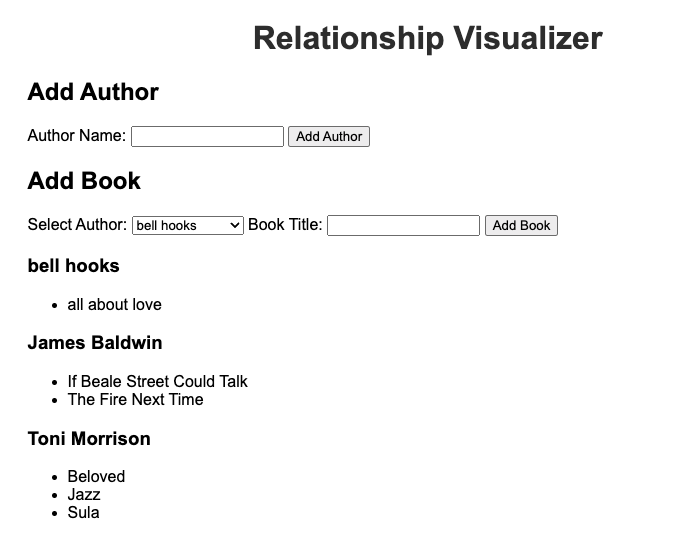

# 5-1-1-has-many-belongs-to-front-end

This repo contains a Vite app that has been built out for you to implement a **has many / belongs to** relationship between classes. 

The app allows users to maintain a list of **Authors** and **Books** by those authors.

Before you begin, read through the code and understand the structure. 
* The `utils` folder contains a `getId.js` file with an id-generating function and a `render-functions.js` file with functions for rendering the front end components.
* The `models` folder has two files, `has-many.js` and `belongs-to.js`, each defining a class.
* The `main.js` file is the entry point, renders the main components, and also defines event handlers

**Your task is to** replace the classes in the `models` folder with classes of your own to demonstrate a new has many / belongs to relationship. You should also update the front-end code to utilize your new classes. 

Examples of has many / belongs to classes include:
- `Doctor` and `Appointment`
- `Playlist` and `Song`
- `Class` and `Student`
- `Team` and `Player`

Have fun!
