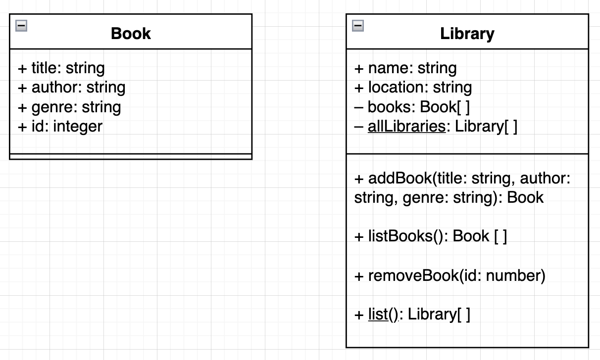
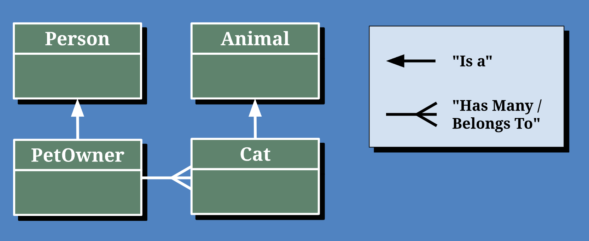

# Has Many / Belongs To

## Class Diagrams

When building an application, the first step is always to make a plan. 
* We plan the features of the application with **user stories**
* We plan the user interface with a **wireframe**

Now that we're preparing to build more complex applications, we need to start thinking about how we plan our data. This plan is often called the **data architecture** and can be represented with a **Class Diagram**.

UML stands for **U**nified **M**odeling **L**anguage and it defines a way of describing classes and their relationships.


## Practice

Class Diagrams can be created using a tool like https://draw.io or they can simply be drawn using pen and paper.

**TODO:** Take a moment and create a diagram for the `Book` class below:

```js
class Book {
  static #allBooks = []

  constructor(title, author, genre) {
    this.title = title;
    this.author = author;
    this.genre = genre;
    this.id = getId();

    Book.#allBooks.push(this);
  }

  static list() {
    return [...Book.#allBooks];
  }

  static find(id) {
    return Book.#allBooks.find((book) => book.id === id);
  }
}
```

Now, to the right of your `Book` diagram, create a diagram for the `Library` class below:

```js
class Library {
  #books = [];                // Private Instance Property
  static #allLibraries = []   // Private Class Property

  constructor(name, address) {
    this.name = name;
    this.address = address;
    this.id = getId();

    Library.#allLibraries.push(this);
  }

  // Library Instance Methods
  addBook(title, author, genre) {
    const addedBook = new Book(title, author, genre);
    this.#books.push(addedBook);
    return addedBook;
  }
  listBooks() {
    return [...this.#books];
  }
  removeBook(id) {
    this.#books.splice(this.#books.findIndex((book) => book.id === id), 1);
  }

  // Library Class Methods
  static list() {
    return [...Library.#allLibraries];
  }
  static find(id) {
    return Library.#allLibraries.find((library) => library.id === id);
  }
}
```

**<details><summary style="color: purple">Book and Library Diagrams</summary>**

In this diagram, we take it a step further and define the type of each property, method parameter, and returned value of each method. This is called the **signature** of a property/method.



</details><br>

## Entity Relationships

Class diagrams can show the data and functionality of a class, but the relationships between classes is just as important. We can turn our diagrams from simple class diagrams to **Entity Relationship Diagrams** (ERDs) by connecting them.

There are many types of relationships, and many ways to represent them.
Below is a common way to represent relationships between classes:
* "Has many / belongs to" (a.k.a. "one to many")
* "Is A" (a.k.a. "Inheritance")



**<details><summary style="color: purple">Q: What is the relationship between the `Library` and `Book` classes?</summary>**
> A library has many books. A book belongs to a Library
</details><br>

Later this week, we'll learn how to implement an "Is A" relationship with the `extends` keyword.

**TODO:** Draw the correct association line between your two classes. If you are using draw.io, go to the "ERD" section and find the "one-to-many" connector

**<details><summary style="color: purple">Example: Library and Books ERD</summary>**


</details><br>


## Make some has many / belongs to class relationships

Below are some examples of pairs of classes that you can create that will have a "has many / belongs to" relationship.

* `Doctor` and `Appointment`
* `Playlist` and `Song`
* `Group` and `User`
* `Class` and `Student`

With a partner:

1. Create the class diagram for each class along with the relationship arrow between them. 
2. Then, implement the classes in JavaScript.


Attempt to have a combination of private and public properties / methods, and static and instance properties / methods.

Check out the `library-book-example.js` file for an example.
